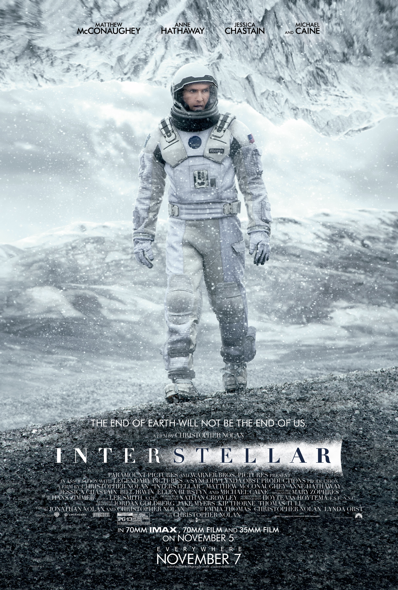
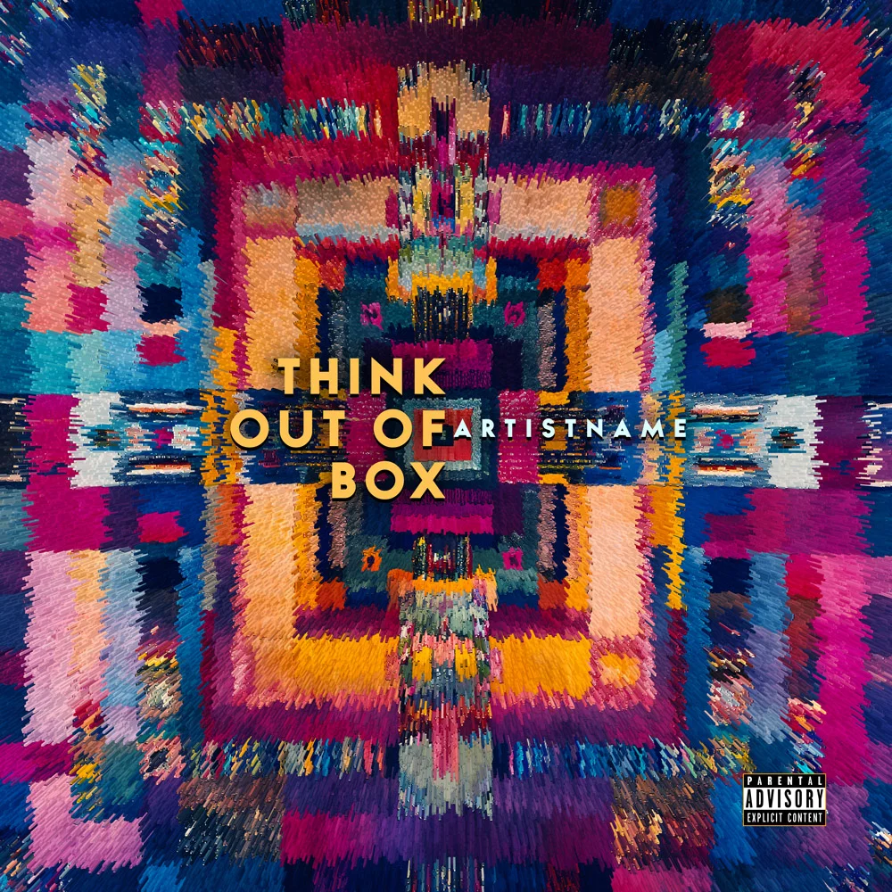
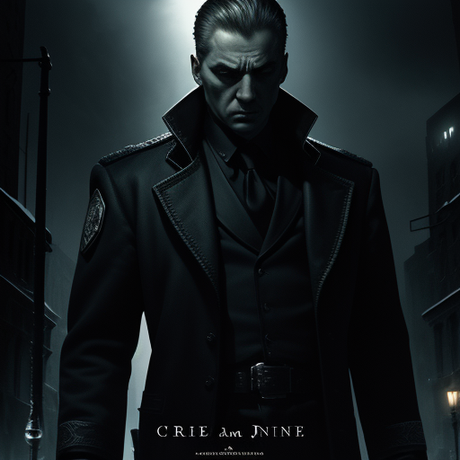
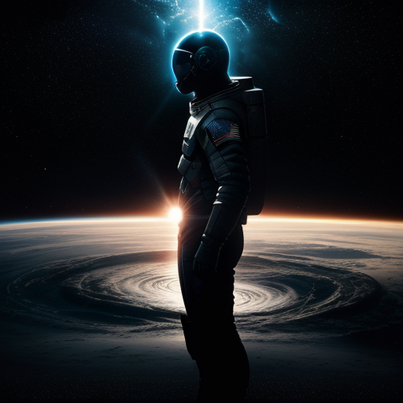
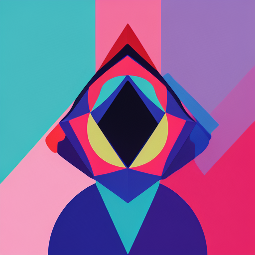
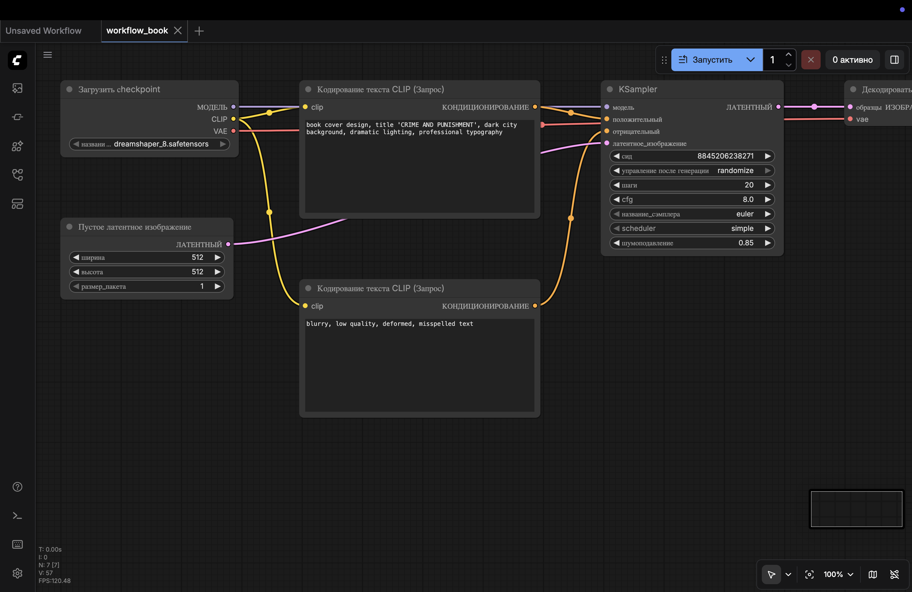
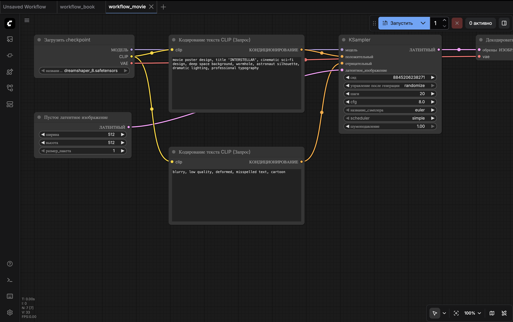
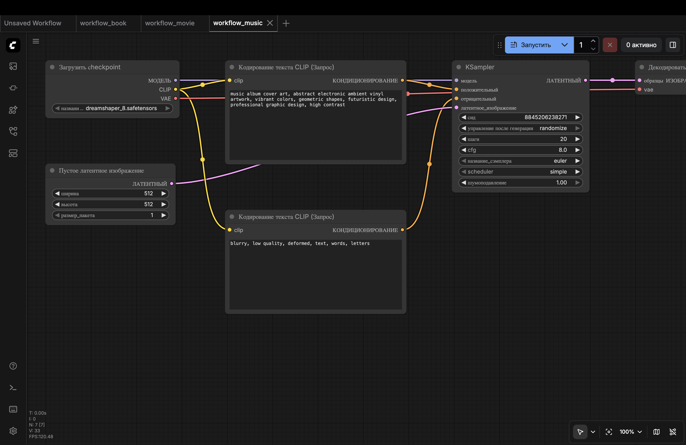

# Alternative Cover Art Generation - Capstone Project Report

**Author:** Turayev Komiljon (EPAM Systems, Inc.)
**Email:** komiljon_torayev@epam.com
**GitHub:** https://github.com/KomiljonTurayev/data_inside_app

---

## 1. Original Works

The following original works were selected as source material for AI-generated alternative covers:

| # | Media Type | Title | Author / Artist | Format |
|---|-----------|-------|-----------------|--------|
| 1 | Book | *Crime and Punishment* | Fyodor Dostoevsky | Book cover |
| 2 | Movie / Video | *Interstellar* | Christopher Nolan | DVD box / VHS tape |
| 3 | Music / Audio | *Abstract Electronic Album* | — | Vinyl album / Compact disk |

> **Note:** Insert original cover images below for comparison.

### Original Covers (reference)

| Book | Movie | Music |
|------|-------|-------|
|  |  |  |

---

## 2. AI-Generated Works

### 2.1 Book Cover - "Crime and Punishment"

| | |
|---|---|
| **Media type** | Book cover |
| **Original** | *Crime and Punishment* by Fyodor Dostoevsky |
| **Generated image** | See `app/static/images/generated/` |

**Positive prompt:**
```
book cover design, title 'CRIME AND PUNISHMENT', dark city background,
dramatic lighting, professional typography
```

**Negative prompt:**
```
blurry, low quality, deformed, misspelled text
```



---

### 2.2 Movie / Video Cover - "Interstellar"

| | |
|---|---|
| **Media type** | DVD box / VHS tape |
| **Original** | *Interstellar* (2014), dir. Christopher Nolan |
| **Generated image** | See `app/static/images/generated/` |

**Positive prompt:**
```
movie poster design, title 'INTERSTELLAR', cinematic sci-fi design,
deep space background, wormhole, astronaut silhouette, dramatic lighting,
professional typography
```

**Negative prompt:**
```
blurry, low quality, deformed, misspelled text, cartoon
```



---

### 2.3 Music Album Cover - "Abstract Electronic Album"

| | |
|---|---|
| **Media type** | Vinyl album / Compact disk |
| **Original** | Abstract Electronic Album |
| **Generated image** | See `app/static/images/generated/` |

**Positive prompt:**
```
music album cover art, abstract electronic ambient vinyl artwork,
vibrant colors, geometric shapes, futuristic design,
professional graphic design, high contrast
```

**Negative prompt:**
```
blurry, low quality, deformed, text, words, letters
```



---

## 3. Workflow

### 3.1 Image Generation Model

| Property | Value |
|----------|-------|
| **Model name** | DreamShaper 8 |
| **Base architecture** | Stable Diffusion 1.5 |
| **Model file** | `dreamshaper_8.safetensors` |
| **Format** | SafeTensors (pruned) |
| **File size** | ~2 GB |
| **Link** | https://civitai.com/models/4384/dreamshaper |
| **Version** | 8 |

### 3.2 LoRAs / Adapters / Extensions

**None used.** The project uses only the base DreamShaper 8 checkpoint with standard ComfyUI nodes:
- No LoRA adapters
- No ControlNet
- No custom ComfyUI nodes or extensions
- Standard CLIP text encoder (built into checkpoint)
- Standard VAE decoder (built into checkpoint)

### 3.3 Technical Generation Details

#### KSampler Parameters

| Parameter | Value |
|-----------|-------|
| **Seed** | `8845206238271` |
| **Steps** | `20` |
| **CFG Scale** | `8` |
| **Sampler** | `euler` |
| **Scheduler** | `simple` |
| **Denoise** | `1.0` |
| **Width** | `512 px` |
| **Height** | `512 px` |
| **Batch size** | `1` |
| **Output format** | PNG |

#### Adjustable Ranges (via Web UI)

| Parameter | Min | Max | Step |
|-----------|-----|-----|------|
| Steps | 1 | 100 | 1 |
| CFG Scale | 1 | 30 | 0.5 |
| Width | 256 | 1024 | 64 |
| Height | 256 | 1024 | 64 |

### 3.4 Pipeline / Configuration

The project uses a **ComfyUI node-based workflow** with 7 nodes:

```
┌─────────────────────────┐
│ Node 4                  │
│ CheckpointLoaderSimple  │
│ dreamshaper_8.safetensors│
│                         │
│ Outputs:                │
│  [0] MODEL ─────────────┼──────────────────────┐
│  [1] CLIP ──────┬───────┼───────────┐          │
│  [2] VAE ───────┼───────┼─────────┐ │          │
└─────────────────┼───────┘         │ │          │
                  │                 │ │          │
    ┌─────────────┼─────┐          │ │          │
    │             │     │          │ │          │
    ▼             ▼     │          │ │          │
┌────────────┐ ┌────────────┐     │ │   ┌──────────────┐
│ Node 6     │ │ Node 7     │     │ │   │ Node 5       │
│ CLIPText   │ │ CLIPText   │     │ │   │ EmptyLatent  │
│ Encode     │ │ Encode     │     │ │   │ Image        │
│ (POSITIVE) │ │ (NEGATIVE) │     │ │   │ 512x512, b=1 │
└─────┬──────┘ └─────┬──────┘     │ │   └──────┬───────┘
      │              │            │ │          │
      │   positive   │  negative  │ │  latent  │
      ▼              ▼            │ │          ▼
┌─────────────────────────────────┼─┼──────────────┐
│ Node 3 - KSampler              │ │              │
│                                │ │              │
│ seed: 8845206238271            │ │              │
│ steps: 20                      │ │              │
│ cfg: 8                         │ │              │
│ sampler: euler                 │ │              │
│ scheduler: simple              │ │              │
│ denoise: 1.0                   │ │              │
│                                │ │              │
│ Output: [0] LATENT ────────────┼─┼──┐           │
└────────────────────────────────┘ │  │           │
                                   │  │           │
                                   ▼  ▼           │
                          ┌────────────────┐      │
                          │ Node 8         │      │
                          │ VAEDecode      │      │
                          │                │      │
                          │ Output: IMAGE ─┼──┐   │
                          └────────────────┘  │   │
                                              ▼   │
                                     ┌────────────┐
                                     │ Node 9     │
                                     │ SaveImage  │
                                     │ "CoverArt" │
                                     │ → PNG file │
                                     └────────────┘
```

#### Book Cover Pipeline


#### Movie Cover Pipeline


#### Music Album Pipeline


### 3.5 Prompts Used

All prompts are defined in `config.py` (lines 40-68):

#### Book Cover

| | Prompt |
|---|---|
| **Positive** | `book cover design, title 'CRIME AND PUNISHMENT', dark city background, dramatic lighting, professional typography` |
| **Negative** | `blurry, low quality, deformed, misspelled text` |

#### Movie / Video Cover

| | Prompt |
|---|---|
| **Positive** | `movie poster design, title 'INTERSTELLAR', cinematic sci-fi design, deep space background, wormhole, astronaut silhouette, dramatic lighting, professional typography` |
| **Negative** | `blurry, low quality, deformed, misspelled text, cartoon` |

#### Music Album Cover

| | Prompt |
|---|---|
| **Positive** | `music album cover art, abstract electronic ambient vinyl artwork, vibrant colors, geometric shapes, futuristic design, professional graphic design, high contrast` |
| **Negative** | `blurry, low quality, deformed, text, words, letters` |

---

## 4. Resources Used

### 4.1 WebUI for Generation

| Property | Value |
|----------|-------|
| **Tool** | ComfyUI |
| **Link** | https://github.com/comfyanonymous/ComfyUI |
| **Version** | Latest (cloned from GitHub) |
| **Interface** | Node-based workflow editor at `http://127.0.0.1:8188` |
| **Deployment** | Local (self-hosted) |

### 4.2 Local or Cloud

| Property | Value |
|----------|-------|
| **Execution mode** | Fully local |
| **Cloud APIs** | None |
| **Containerization** | Docker + Docker Compose |
| **ComfyUI launch flag** | `--cpu` (CPU-only mode) |

### 4.3 Hardware Used

| Component | Details |
|-----------|---------|
| **Execution device** | CPU (no GPU) |
| **Python version** | 3.13.6 |
| **OS** | macOS (Darwin) |
| **RAM** | 8 GB minimum recommended |
| **Storage** | ~2.5 GB (model) + generated images |

### 4.4 Software Dependencies

| Package | Version |
|---------|---------|
| Flask | 3.1.0 |
| websocket-client | >= 1.6.0 |
| Pillow | >= 10.0.0 |
| PyTorch | CPU variant (via ComfyUI) |

---

## 5. Media Format Options

The generated cover art can be applied to the following media formats:

| # | Media Format | Cover Type | Status |
|---|-------------|-----------|--------|
| 1 | Compact disk album | Music | Available |
| 2 | Vinyl album | Music | Available |
| 3 | VHS tape | Movie / Video | Available |
| 4 | DVD box | Movie / Video | Available |
| 5 | Book | Literature | Available |

---

## 6. Generated Images

The following images were generated during the project:

| # | Type | Filename | Location |
|---|------|----------|----------|
| 1 | Book cover | `book_generated.png` | `app/static/images/generated/` |
| 2 | Movie poster | `movie_generated.png` | `app/static/images/generated/` |
| 3 | Music album | `music_generated.png` | `app/static/images/generated/` |

| Book | Movie | Music |
|------|-------|-------|
|  |  |  |

Raw ComfyUI outputs are also stored in `ComfyUI/output/`.

---

## 7. Exported Workflow Files

ComfyUI-compatible workflow JSON files are available for import:

| File | Cover Type |
|------|-----------|
| `workflows/workflow_book.json` | Book cover |
| `workflows/workflow_movie.json` | Movie poster |
| `workflows/workflow_music.json` | Music album |

These can be imported directly into ComfyUI's web interface via **Load Workflow**.
